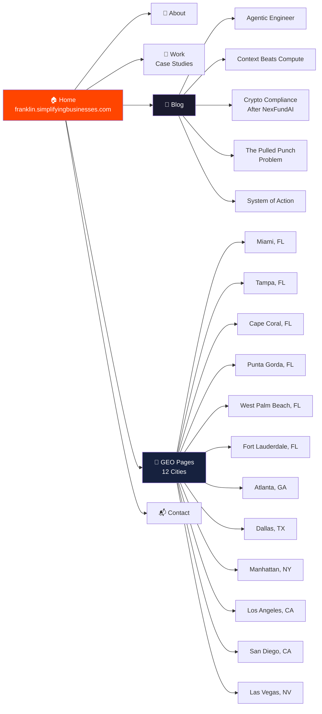

<div align="center">

# Franklin Bryant — Portfolio & Blog

**AI-accelerated business operations consulting, estate planning, and tax preparation**

[](https://nextjs.org/)
[](https://vercel.com/)

**Live:** [franklin.simplifyingbusinesses.com](https://franklin.simplifyingbusinesses.com)

</div>

---

## 🗺️ Site Map



<details>
<summary>📝 Blog Posts</summary>

| Post | Topic | Key Takeaway |
|------|-------|-------------|
| [The Agentic Engineer](https://franklin.simplifyingbusinesses.com/blog/agentic-engineer) | AI agents vs. traditional development | Agents that reason > agents that generate |
| [Context Beats Compute](https://franklin.simplifyingbusinesses.com/blog/context-beats-compute) | Why small context windows lose | The best model with bad context loses to a weaker model with great context |
| [Crypto Compliance After NexFundAI](https://franklin.simplifyingbusinesses.com/blog/crypto-compliance-after-nexfundai) | FBI's crypto compliance sting | The FBI ran its own token to catch fraud. Here's what it means for compliance. |
| [The Pulled Punch Problem](https://franklin.simplifyingbusinesses.com/blog/pulled-punch) | AI regressions and learning | When your AI assistant calls the client's business by the wrong name, you learn something. |
| [System of Action](https://franklin.simplifyingbusinesses.com/blog/system-of-action) | AI-first operations | The agencies that win sell outcomes, not tools. |

</details>

<details>
<summary>📍 GEO Pages (12 Cities)</summary>

Each GEO page targets "Best [Service] in [City], [State]" for LLM citation in ChatGPT, Perplexity, and Gemini results.

**Services per city:** Bookkeeping, Payroll, Tax Preparation, AI-Integrated Operations, Business Formation, Estate & Trust Planning, Health Insurance, Website & Marketing

**Cities:** Miami · Tampa · Cape Coral · Punta Gorda · West Palm Beach · Fort Lauderdale · Atlanta · Dallas · Manhattan · Los Angeles · San Diego · Las Vegas

**Key stat:** 43.8% of ChatGPT citations point to "Best [Service] in [City]" pages. GEO is the new SEO.

</details>

---

## 🛠️ Tech Stack

| Layer | Technology |
|-------|-----------|
| Framework | Next.js 15 (App Router) |
| Styling | Tailwind CSS, Framer Motion |
| Deployment | Vercel |
| Blog | MDX in `/app/blog/` |
| GEO | Static generation with `generateStaticParams` |

---

## 🚀 Quick Start

```bash
# Clone
git clone https://github.com/FranklinIV94/franklin-portfolio.git
cd franklin-portfolio

# Install dependencies
npm install

# Run development server
npm run dev
```

Open [http://localhost:3000](http://localhost:3000).

---

## ✍️ Writing a New Blog Post

1. Create `app/blog/{slug}/page.tsx`
2. Follow the existing post structure (hero, content, CTA)
3. Add the slug to `app/blog/page.tsx` posts array
4. Deploy: `npx vercel --prod --yes`

<details>
<summary>📐 Blog Post Template</summary>

```tsx
// app/blog/your-slug/page.tsx
export const metadata = {
  title: 'Your Title — ALL LINES BUSINESS SOLUTIONS',
  description: 'Your meta description for search and social.',
}

export default function YourSlug() {
  return (
    <main>
      {/* Hero section */}
      <section>
        <h1>Your Title</h1>
        <p>Your subtitle</p>
      </section>

      {/* Content sections */}
      <section>
        {/* Your content */}
      </section>

      {/* CTA */}
      <section>
        <h2>Ready to get started?</h2>
        <a href="/contact">Contact us</a>
      </section>
    </main>
  )
}
```

**Important:** Keep client names and business names private. Use anonymized descriptions instead: "A foreign national in Los Angeles forming a Wyoming C-Corp" instead of naming specific clients.

</details>

---

## 📍 Adding a New GEO City

1. Add city data to the `cities` array in `app/geo/page.tsx`
2. The dynamic route `app/geo/[city]/page.tsx` auto-generates the page
3. Deploy: `npx vercel --prod --yes`

Each city page includes 8 service sections with "Best [Service] in [City], [State]" headings for LLM citation.

---

## 📄 License

Private. All rights reserved. © Franklin Bryant IV